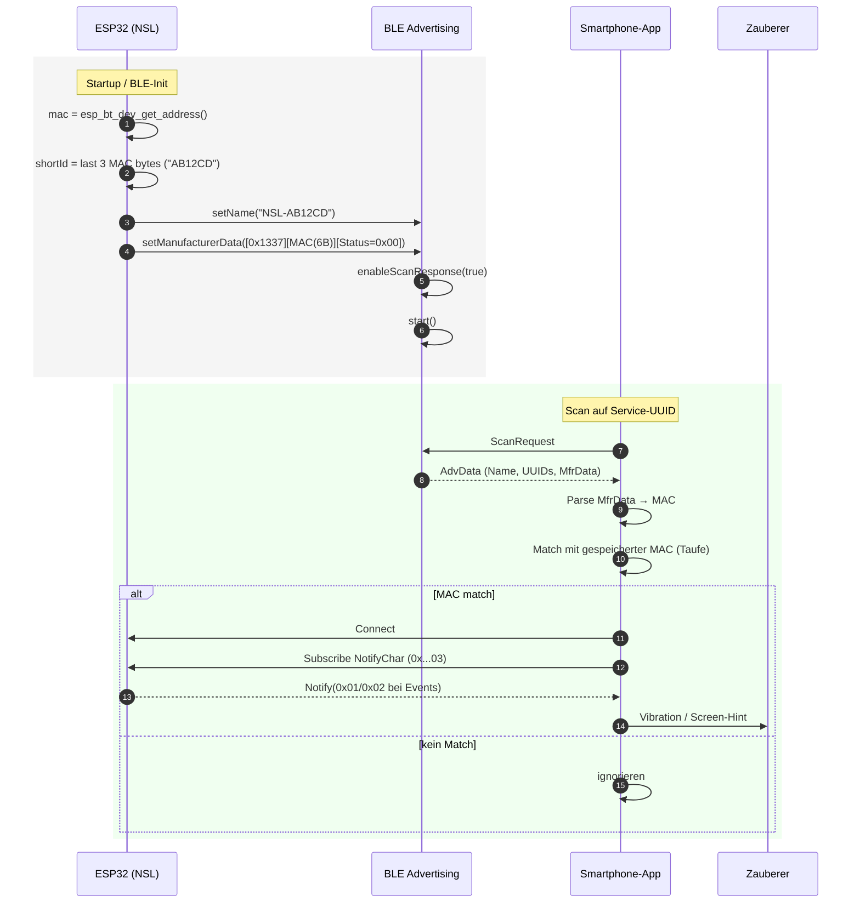

# Nasreddin’s Secret Listener — BLE Protokoll

**Version:** 1.0 · **Board:** ESP32 (M5Stack Atom Lite) · **BLE-Stack:** NimBLE-Arduino 2.3.x

Ziel: Kurze, präzise Übersicht der **Advertising-Daten**, **GATT-Services/Characteristics** sowie des **Payload-Formats**. Am Ende gibt’s ein **Mermaid-Sequenzdiagramm** (GitHub rendert das direkt).

---

## 1) Identität & Wiedererkennung

### 1.1 Geräte-Name (Advertising)

* Schema: `NSL-<SHORTID>`
* `SHORTID` = 3 MAC-Bytes als Hex (z. B. letzte 3 Bytes): `AB12CD`
  → Beispiel: **`NSL-AB12CD`**
* Zweck: Menschlich erkennbar, Kurzlabel in Listen. Die App soll **nicht** darauf vertrauen, sondern immer die MAC aus Manufacturer Data matchen (s.u.).

### 1.2 Manufacturer Data (Advertising)

* **Company ID (Test):** `0x1337` (2 Byte, little-endian im AD-Block)
  *(Du kannst später eine offizielle Company ID hinterlegen.)*
* **Payload (prototyp):**

  ```
  [2B CompanyID][6B BLE-MAC][1B Status]
  ```

  * **BLE-MAC:** 6 Byte, so wie `esp_bt_dev_get_address()` liefert (konsequent auf App-Seite interpretieren).
  * **Status (optional):** 0x00=None, 0x01=Early, 0x02=Confirmed. (Hilft für Live-Listen, ist aber optional.)

**Beispiel (Hex):**

```
CompanyID: 37 13
MAC:       A1 B2 C3 D4 E5 F6
Status:    02
⇒ 37 13 A1 B2 C3 D4 E5 F6 02
```

> **Warum Manufacturer Data?**
> Die App kann beim **Scannen** bereits eindeutig auf „ihr“ Gerät filtern (MAC-Match), **ohne** vorher zu verbinden. Das ist robust, schnell und funktioniert auch bei mehreren Geräten im Raum.

---

## 2) GATT-Layout (Server auf ESP32)

| Element                           | UUID                                   |     Properties | MTU/Size | Beschreibung                                      |
| --------------------------------- | -------------------------------------- | -------------: | -------: | ------------------------------------------------- |
| **Service**                       | `6E400001-B5A3-F393-E0A9-E50E24DCCA9E` |              – |        – | Hauptservice „NSL“                                |
| **Notify Char**                   | `6E400003-B5A3-F393-E0A9-E50E24DCCA9E` |     **Notify** |   1 Byte | **Status**: 0x00=None, 0x01=Early, 0x02=Confirmed |
| *(optional, geplant)* Config Char | `6E400004-B5A3-F393-E0A9-E50E24DCCA9E` | **Read/Write** |  ≤ 128 B | JSON/TLV für Name/Thresholds etc. (NVS)           |

**Notify-Payload (1 Byte):**

```
0x00 = NONE        (kein Magnet)
0x01 = EARLY       (Annäherung, Trend/Look-Ahead)
0x02 = CONFIRMED   (sicher erkannt; Schwelle über Baseline)
```

Sende-Regel: **Nur bei Zustandswechsel** notifizieren (reduziert Funklast).
Frequenz: interner Loop \~50 Hz, Notify i. d. R. << 50 Hz (events).

---

## 3) Verbindungslogik (App-Seite, kurz)

1. **Scan** nach Service-UUID `6E400001-…`
2. **Herstellerdaten** lesen → MAC extrahieren → mit **lokal gespeicherter MAC** (aus „Taufe“) vergleichen.
3. Nur beim **MAC-Treffer**: **Verbinden** → **Notify Char subscriben**.
4. Bytewert aus Notify interpretieren → Vibration/Feedback auslösen.
5. (Später) **Config Char** zum Setzen von Name/Parametern nutzen.

---

## 4) Sicherheit & Zukunft

* **Heute (MVP):** „Just Works“, MAC-Match über Manufacturer Data.
* **Kurzfristig:** App generiert **Device-Token (16 B)** bei der „Taufe“, schreibt es in Config-Char; ESP32 hebt es in NVS auf und versieht Notifies mit **Rolling Counter**. App prüft Token+Counter (Replay-Schutz).
* **Langfristig:** Pairing/Bonding, Whitelist nur „bekannte Central“, private addresses, etc. (NimBLE kann das; Show-Kontext entscheidet, ob nötig.)

---

## 5) Beispiel-API (Firmware)

Auszug aus `BleService`:

```cpp
#pragma once
#include <NimBLEDevice.h>
#include "Config.h"
#include "LedDisplay.h" // MagnetState enum

class BleService {
public:
  void begin(const char* deviceName = BLE_DEVICE_NAME);
  void notify(MagnetState s);     // sendet 1 Byte (0x00/0x01/0x02)
  void stop();                    // optional (vor DeepSleep)
private:
  struct ServerCbs : public NimBLEServerCallbacks {
    void onConnect(NimBLEServer* pServer, NimBLEConnInfo& connInfo) override;
    void onDisconnect(NimBLEServer* pServer, NimBLEConnInfo& connInfo, int reason) override;
  };
  NimBLEServer* server = nullptr;
  NimBLECharacteristic* notifyChar = nullptr;
};
```

Advertising (vereinfacht, relevante Punkte):

* **Name:** `NSL-<SHORTID>`
* **Service UUID:** `6E400001-…`
* **Manufacturer Data:** `[CompanyID=0x1337][MAC(6B)][Status(1B)]`
* **Scan Response:** aktiv

---

## 6) Sequenzdiagramm (Mermaid)



---

## 7) Test/Kompatibilität

* **BLE-Name & Sonderzeichen:** Apostrophe/Sonderzeichen vermeiden (einige Stacks/Scanner mögen das nicht).
* **Länge vom Adv-Name:** Gesamtes Adv-Paket ist limitiert (\~31 B p. PDU) → Name kurz halten; Manufacturer-Data im Zweifel per **Scan Response** ergänzen (aktiv).
* **Byte-Reihenfolge (MAC):** Konsistenz sicherstellen (Anzeige vs. Matching). Empfehlung:

  * **ShortID** = menschlich lesbar, fix definiert (z. B. „letzte 3 Bytes in Big-Endian“).
  * **Manufacturer Data MAC** = 1:1 wie vom Controller geliefert; App weiß die Reihenfolge.

```

---

## 8) TL;DR

* **Scannen:** Service-UUID filtern → Manufacturer-Data lesen → MAC matchen.
* **Verbinden:** Notify-Char abonnieren → 1-Byte-Status empfangen.
* **Zukunft:** Config-Char für Label/Thresholds; optional Token+Counter für Auth.

