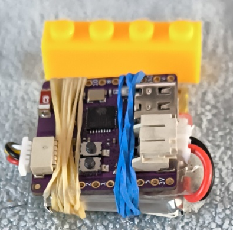
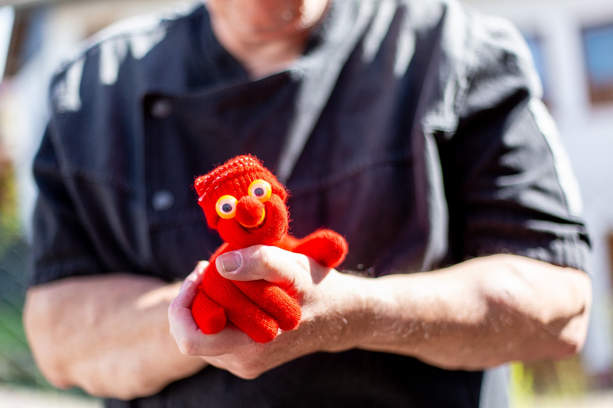

# Nasreddins Secret Listener (NSL)

## Magie trifft Technik

Die Grundidee dieses kleinen Projekts war, eine bezahlbare technische Lösung zu finden, um den sogenannten „Which Hand“-Trick elektronisch umzusetzen.  

Als Amateurzauberer ist es wirtschaftlich nicht darstellbar, ein Gerät für über 200 € zu kaufen, um ein Kunststück bzw. Routine von vielleicht ein oder zwei Minuten Dauer zu haben. 

Der DIY-Gedanke war naheliegend, da ich mich schon seit Jahren mit der Thematik Mikrocontroller im Bereich von IoT außeinandersetze.

Es gibt ganz verschiedene Ansätze, wie man das Kunststück ausführen kann – rein mental, mechanisch oder elektronisch. Viele der kommerziellen elektronischen Lösungen sind teuer, meist im Preisbereich über 200€.

Mein Ziel war es daher, eine robuste, nachvollziehbare und preisgünstige Variante mit gut erhältlichen Standardbauteilen zu entwickeln. Hierbei war der Aspekt "Standardbauteile" besonders wichtig. Der Aufwand sollte sich auf das Zusammenstecken und ggf. einzelnen Lötarbeiten mit Kabeln beschränken.

**Zielsetzung**

- Preisgünstig – möglichst unter 50 € (aktuell ca. 40€ - Siehe Einkaufsquellen am Ende des Textes)
- Bauteile leicht zu beschaffen in DE
- Bis auf wenige Lötarbeiten mit gängiger Hardware umsetzbar
- Notifikation auch auf Smartwatches

## Videos (Youtube)

Die nachfolgenden Videos sind alle mehr oder weniger ohne Script entstanden um NSL auf einfache Weise vorzustellen. Gefilmt aus der freien Hand, meist einhändig. Irgendwann mache ich das vielleicht mal etwas besser. Mal sehen....

* Testlauf im Urlaub (Ferienwohnung) - https://youtu.be/8nuGtZGBIqA
* Nasreddin zeigt wie es geht - https://www.youtube.com/watch?v=QMSNmQHZKCU
* Video über ESP32 und Magnetometer - Beschreibung des Gerätes - https://youtu.be/cL9djASFSl
* Die Android Companion App - https://youtu.be/Q3gSeytvbNk

## Technische Basis

Das Herzstück ist ein **QMC5883L-Magnetometer Chip** auf einem kleinen Breakout-Board (GY-273). Dieser Sensor erkennt Magnete zuverlässig – ideal für den geplanten Einsatz.  Es gibt von Adafruit eine gut dokumentierte Bibliothek, die den gesamten I²C-Overhead verwaltet und so die Ansteuerung erleichtert.

> Hinweis: Entgegen mancher Aussagen in Foren funktioniert die Erkennung eines Magneten in der Nähe mit diesem Chip zuverlässig, wenn man den notwendigen Rechenaufwand gelöst hat. Ein wenig Mathe ist dazu schon notwendig.

## Roadmap

- Anbindung per Bluetooth LE, Kommunikation zwischen ESP32 Device und Smartphone - (ERLEDIGT)
- ~~Umstellung auf Seeed Studio XIAO ESP32S3 mit integriertem Akkuanschluss und Ladeschaltung  
  Quelle: <https://wiki.seeedstudio.com/xiao_esp32s3_getting_started/> - Wurde verworfen, da diese Platine nicht alle notwendigen Features bereitstellt.~~
- Entwicklung einer Smartphone-App als ~~Progressive Web App (PWA)~~ oder alternativ als MAUI-App
  - PWA wurde verworfen, da die Ansteuerung von Bluetooth nicht zu meiner Zufriedenheit gelöst werden konnte. (VERWORFEN)
  - Der Ansatz via MAUI hat sich als deutlich einfacher erwiesen  (ERLEDIGT)
- TODO: Möglichkeit zur Magnet-Kalibrierung direkt vom Smartphone aus (==TBD==)
- TODO: Sammlung von Kunststückideen, z. B.:
  - TODO: „Which Hand“ – der Klassiker (==Video TBD==)
  - TODO: „Nasreddin zaubert“ (==Video TBD==)
  - TODO: Weitere Anwendungen
- Umstellung des ESP32 Boards auf das Board **Wemos Lolin C3 PICO ESP32-C3**. Dieses Board erfüllt alle Anforderungen die man für das Projekt benötigt. (ERLEDIGT)
- Prototyp erststellen (ERLEDIGT)
- Notifikation an Smartwach weitergeben (ERLEDIGT)
- TODO: Smartwatch als Bluetooth Client erstellen. Direktverbindung von Smartwatch zu Device ohne "Mann in the Middle(Smartphone)"
- TODO: Zentrale Konfigurationsdatei einbinden, so dass UID Änderungen automatisch in beiden Anwendungsteilen (Smartphone Companion und ESP32 Device) vorhanden sind.

## Prototyp - 2025-09-06

Hier ist nun der erste Prototyp. Mit Akku, Magnetometer und voll funktionsfähig.  Geplant ist das dann mal irgendwann in Schrumpfschlauch einzupacken. Aktuell zum testen nun einfach mal mit zwei Gummies zusammengehalten. Zum Größenvergleich einfach mal ein 4x1 Legostein. Für mich jetzt erst einmal fast perfekt. (Bauteilkosten ca. 35-40€)

Der Lötaufwand ist extrem gering. Es sind im Prinzip nur die Stecker, die ich fertig konfektioniert kaufe, anzulöten und auf der Platine des WEMO sind zwei Lötbrücken zu schliessen (Lade-LED). Bauzeit ca. 1 Stunde.

## Wer oder was ist Nassreddin?

Nasreddin Hodscha (auch bekannt als Nasreddin, Nasreddin Hoca oder Nasreddin Hodja) ist eine legendäre Figur aus dem türkischen, persischen und arabischen Kulturraum.  Er gilt als Volksweisheitslehrer, Geschichtenerzähler und Schelm, der mit Humor und oft überraschenden Pointen Alltagsweisheiten vermittelt.  

Die Anekdoten um Nasreddin reichen bis ins 13. Jahrhundert zurück und sind in vielen Ländern verbreitet. Mehr zu dieser Figur findet man zum Beispiel hier: <https://de.wikipedia.org/wiki/Nasreddin>  

## Nasr ad-Din al-Quffaz (Nasreddin der Handschuh)

Als der Trick **Mr. Gloves** von Juan Pablo herauskam, habe ich ihn sofort gekauft.  (Review: https://www.youtube.com/watch?v=njTG4mPjbsg) (Einkaufsquelle: https://secret-magic-store.de/collections/zoom-meeting-06-02-2024/products/mr-gloves-juan-pablo)

Die Figur trägt dabei eine markante Mütze – diese hat dazu geführt, dass wir ihr spontan den Namen **Nasr ad-Din al-Quffaz (نصر الدين القفاز)** gaben, was übersetzt etwa „Nasreddin der Handschuh“ bedeutet. So entstand auch der Name dieses Projekts. 

Glaubt mir, er hat viel von Nasreddin Hodscha, wenn er loslegt. Seine Späße lehnen sich gerne mal an die Geschichten seines Namensgebers an.

Auf dem Bild seht ihr eine Variante von Nassreddin. Der orginale Handschuh von Juan Pablo ist, besonders im Sommer, relativ warm. Ich habe mir eine eigene Version von Juans Mr. Glove gebaut inkl. einiger Varianten des Gimmicks. Ihr seht auch, dass ich eine andere Art von Augen verwende. Es sind Fingeraugen die man in Spielzeuggeschäften bekommt. Eine Alternative zu den Augen des Orginaltricks. Die Fingeraugen sind billig und ab und zu verschenkt Nasreddin ein paar an Kinder.... (Im 100er Pack bekommt man die auch günstig in China. Da ich nicht alle Farben gebrauchen kann, gibt es immer gute Abnehmer für den Überschuß)

## Anleitung, Routinen für Kunststsücke, weitere Texte 

[WIKI](https://github.com/hesspet/Nasreddins-Secret-Listener/wiki)

## Nachbau?

Im Prinzip sollten in diesem Repository alle notwendigen Infos zu finden sein. Soweit es mir Möglich ist, kann ich auch Zauberer gerne beim Bau unterstützen.

## Kann ich das Teil bei Dir kaufen?

Ich wollte eigentlich nicht in den Handel damit einsteigen. Es ist ein reines Hobbyprojekt, daher auch die Veröffentlichung zur freien Verfügung als MIT Lizenz- aber mal bei mir Anfragen ist durchaus möglich. In Einzelfällen kann man gerne mal, im Austausch mit Büchern oder so, reden :-)

## Quellen und Dokumentationen

### Dokumentationen

* **Wemos Lolin C3 PICO ESP32-C3** https://www.wemos.cc/en/latest/c3/c3_pico.html
* **QMC5883L-Magnetometer** https://github.com/hesspet/Nasreddins-Secret-Listener/blob/main/Datasheets/HMC5883L_3-Axis_Digital_Compass_IC.pdf
   
### Einkaufsquellen:

*Hinweis: Alle genannten Quellen im Text sind meine Einkaufsquellen. Ich bin in keiner Weise mit diesen Quellen verbunden. Auch handelt es sich nicht um Affiliate Links.*

* **Wemos Lolin C3 PICO ESP32-C3** - z.B.: https://arduino-projekte.info/products/wemos-lolin-c3-pico-esp32-c3
* 2pcs **GY-273 QMC5883L Triple Axis Compass Magnetometer Sensor HMC5883L** - https://www.amazon.de/dp/B07HMK1QNH?ref=ppx_yo2ov_dt_b_fed_asin_title
* **Akku 502525 LiPo 3.7V 220mAh 0.814Wh 27x25x5mm** - https://www.amazon.de/dp/B088DKWJXX?ref=ppx_yo2ov_dt_b_fed_asin_title&th=1 (Leider mit fast 12€ relativ teuer, ich bin noch auf der Suche nach einer günstigeren Quelle)

#### Kunsttücke / Routinen

* Mr. Gloves - z.B.: https://secret-magic-store.de/collections/zoom-meeting-06-02-2024/products/mr-gloves-juan-pablo (Bitte kauft den Trick nicht irgendwo in China, Joan Pablo hat mit dieser Figur eine sehr schönen Trick erfunden.)

