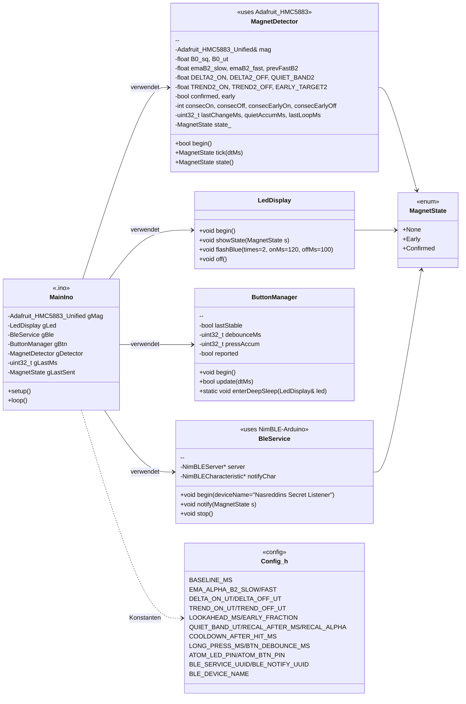
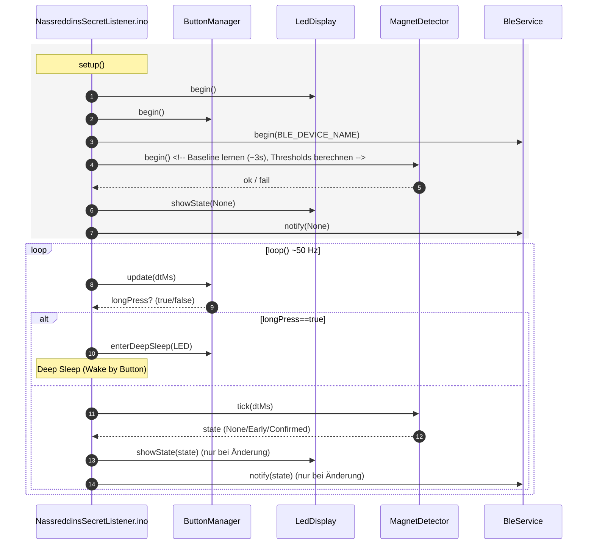
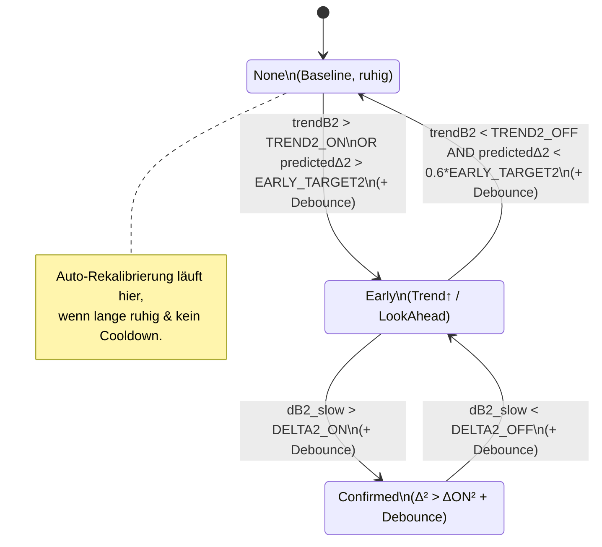

# Klassen



## Sequenzablauf



##  Zustandsautomat MagnetDetector



## BLE-Advertising-Ablauf mit Manufacturer Data

```mermaid
sequenceDiagram
    autonumber
    participant ESP as ESP32<br/>(Nasreddin's Secret Listener)
    participant ADV as BLE Advertising
    participant APP as Smartphone-App<br/>(MAUI)
    participant USER as Zauberer

    rect rgb(245,245,245)
    note over ESP: Startup / BLE-Init
    ESP->>ESP: getBleMac()
    ESP->>ESP: shortId = last 3 bytes of MAC<br/>e.g. "AB12CD"
    ESP->>ADV: Set device name = "NSL-AB12CD"
    ESP->>ADV: Set manufacturer data =<br/>[2B ManufID][6B MAC][1B Status]
    ADV->>ADV: enableScanResponse(true)
    ADV->>ADV: start()
    end

    rect rgb(240,255,240)
    note over APP: Scanning nach BLE_SERVICE_UUID
    APP->>ADV: Scan request
    ADV-->>APP: Advertising data<br/>(Name, UUIDs, Manufacturer Data)
    APP->>APP: Parse manufacturer data<br/>→ Extract MAC & Status
    APP->>APP: Vergleiche mit gespeicherter MAC<br/>aus "Taufe"
    alt MAC match
        APP->>USER: (optional) Anzeige "Gerät gefunden"
        APP->>ESP: Connect + Subscribe NotifyChar
    else MAC mismatch
        APP->>APP: Ignorieren
    end
    end

